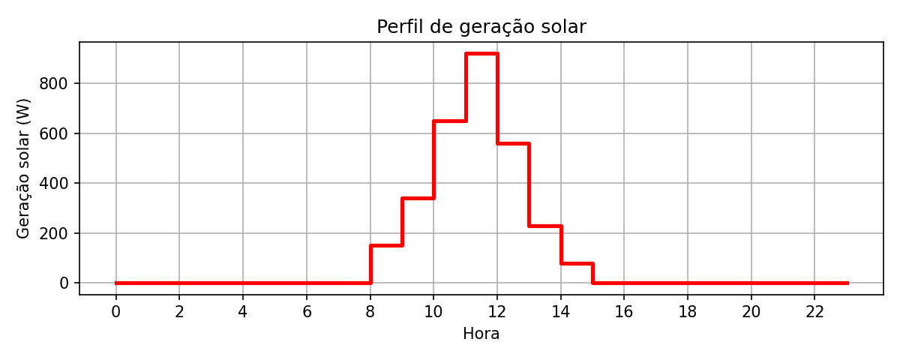
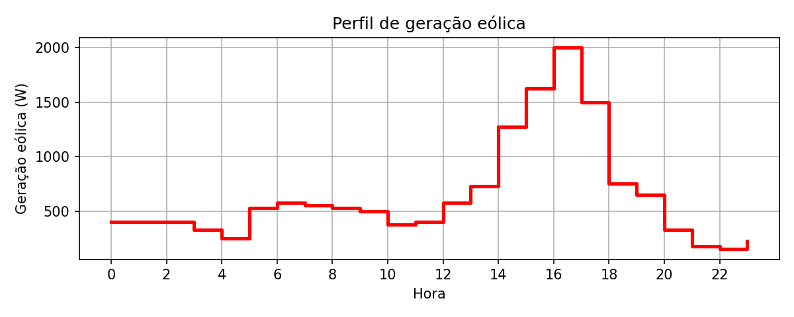
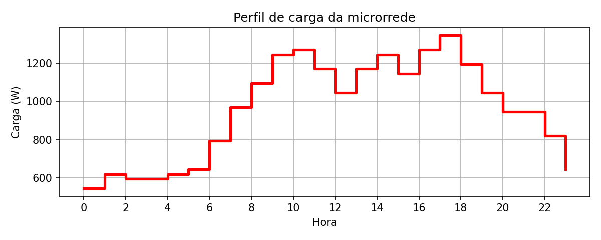
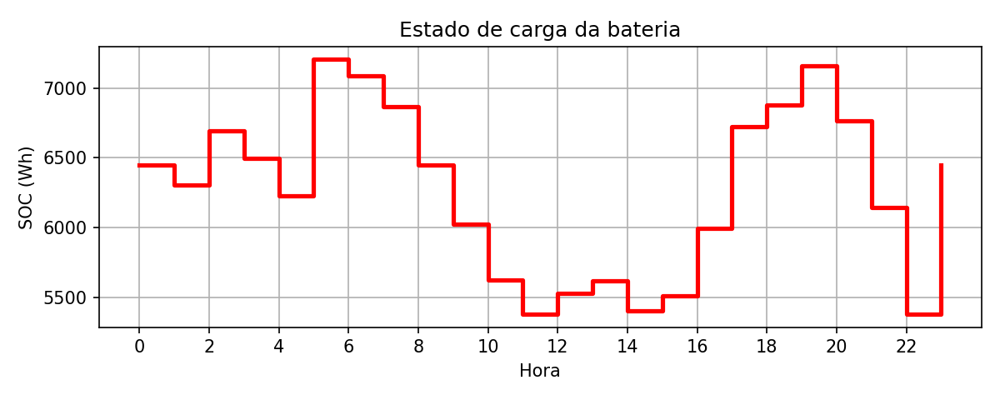
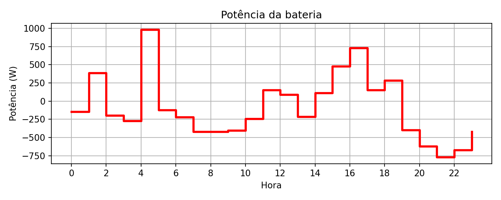
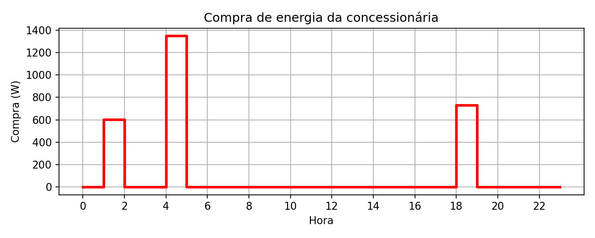
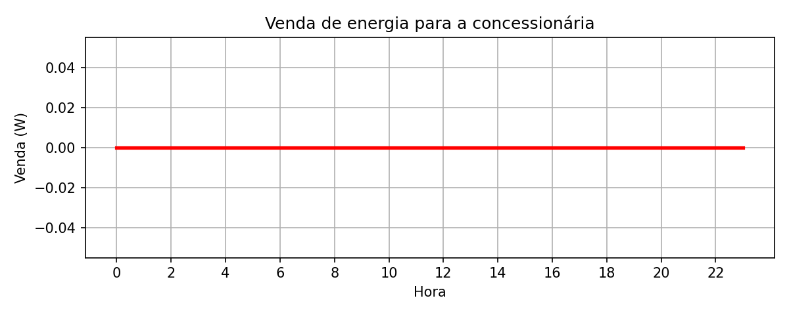

# Resultados

Instância resolvida: demanda alta (`caso = 1`) mais 345 W de carga fixa, horizonte de 24 h. O HiGHS retornou status **ótimo**. O custo de compra é

\[
Z^{*} = 2684{,}8
\]

unidades monetárias. Toda a compra ocorre nas horas de tarifa baixa (\(c_t = 1\)); nas horas de tarifa 2 a microrrede não compra da rede. A venda à concessionária é nula em todo o horizonte: o excedente renovável é absorvido pela bateria.

## Tabela principal

Potências em W e SOC em Wh. Com passo de 1 h, o valor em W coincide com a energia da hora em Wh. A hora segue o índice do código (0 a 23).

| Hora | \(c_t\) | Demanda | Solar | Eólica | Compra | Venda | Carga | Descarga | SOC |
|------|--------:|--------:|------:|-------:|-------:|------:|------:|---------:|----:|
| 0 | 1 | 545 | 0 | 400 | 0 | 0 | 0 | 145 | 6451,2 |
| 1 | 1 | 620 | 0 | 400 | 604,8 | 0 | 384,8 | 0 | 6306,2 |
| 2 | 1 | 595 | 0 | 400 | 0 | 0 | 0 | 195 | 6691,0 |
| 3 | 1 | 595 | 0 | 325 | 0 | 0 | 0 | 270 | 6496,0 |
| 4 | 1 | 620 | 0 | 250 | 1350 | 0 | 980 | 0 | 6226,0 |
| 5 | 2 | 645 | 0 | 525 | 0 | 0 | 0 | 120 | 7206,0 |
| 6 | 2 | 795 | 0 | 575 | 0 | 0 | 0 | 220 | 7086,0 |
| 7 | 2 | 970 | 0 | 550 | 0 | 0 | 0 | 420 | 6866,0 |
| 8 | 2 | 1095 | 150 | 525 | 0 | 0 | 0 | 420 | 6446,0 |
| 9 | 2 | 1245 | 340 | 500 | 0 | 0 | 0 | 405 | 6026,0 |
| 10 | 2 | 1270 | 650 | 375 | 0 | 0 | 0 | 245 | 5621,0 |
| 11 | 2 | 1170 | 920 | 400 | 0 | 0 | 150 | 0 | 5376,0 |
| 12 | 2 | 1045 | 560 | 575 | 0 | 0 | 90 | 0 | 5526,0 |
| 13 | 2 | 1170 | 230 | 725 | 0 | 0 | 0 | 215 | 5616,0 |
| 14 | 2 | 1245 | 80 | 1275 | 0 | 0 | 110 | 0 | 5401,0 |
| 15 | 2 | 1145 | 0 | 1625 | 0 | 0 | 480 | 0 | 5511,0 |
| 16 | 2 | 1270 | 0 | 2000 | 0 | 0 | 730 | 0 | 5991,0 |
| 17 | 2 | 1345 | 0 | 1500 | 0 | 0 | 155 | 0 | 6721,0 |
| 18 | 1 | 1195 | 0 | 750 | 730 | 0 | 285 | 0 | 6876,0 |
| 19 | 1 | 1045 | 0 | 650 | 0 | 0 | 0 | 395 | 7161,0 |
| 20 | 1 | 945 | 0 | 325 | 0 | 0 | 0 | 620 | 6766,0 |
| 21 | 1 | 945 | 0 | 175 | 0 | 0 | 0 | 770 | 6146,0 |
| 22 | 1 | 820 | 0 | 150 | 0 | 0 | 330 | 1000 | 5376,0 |
| 23 | 1 | 645 | 0 | 225 | 0 | 0 | 580 | 1000 | 6451,2 |

Leitura da operação:

- A compra se concentra em três horas de tarifa 1 (horas 1, 4 e 18). Na hora 4 o limite de compra (1350 W) fica ativo e a energia é usada para carregar a bateria antes do pico de tarifa.
- Das horas 5 a 17 a tarifa é 2 e a compra é zero. A demanda é coberta por eólica, solar e pela bateria; quando a geração supera a carga (horas 11, 12 e 14–17), o excedente carrega a bateria.
- O SOC começa e termina em \(0{,}6\,C^{\mathrm{bat}} = 6451{,}2\,\mathrm{Wh}\).
- Nas horas 22 e 23 o solver carrega e descarrega ao mesmo tempo. Com eficiência unitária, só a diferença (descarga − carga) entra no balanço, e essas duas horas não alteram o custo. Outra solução ótima equivalente usa apenas a descarga líquida (670 W na hora 22 e 420 W na hora 23).

Totais no horizonte: compra 2684,8 Wh, venda 0 Wh, custo 2684,8.

## Figuras

Perfis de entrada e a solução ótima, no mesmo formato dos gráficos do notebook.

Potência da bateria = carga − descarga. Valor positivo indica carga; negativo, descarga.

